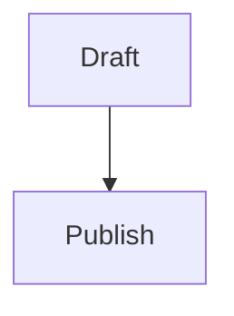

# Deepam Minda

Static personal site for GitHub Pages.

## Local Preview

```sh
python3 -m http.server 8765
```

Open `http://127.0.0.1:8765`.

## Blog Posts

Posts live in `posts/*.md`.

To add a post:

1. Add a Markdown file in `posts/`.
2. Add the post metadata to `posts/index.json`.
3. Link format is `blog/post.html?slug=your-file-name-without-md`.

Supported formatting includes headings, links, images, lists, blockquotes, tables, fenced code blocks with language labels, and Mermaid diagrams:

````md

````

## Publish

Create a public GitHub repo named `mindadeepam.github.io`, then push this folder to `main`.
